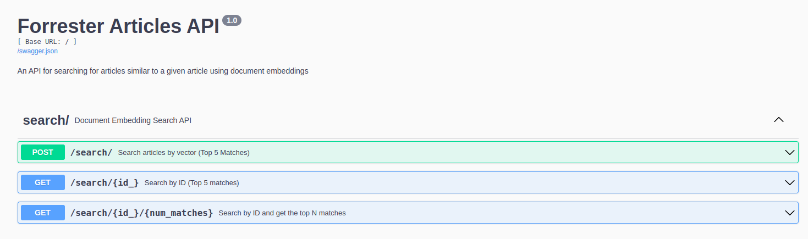

# Forrester Document Embedding Search

This flask app is a demo of how to implement document search with embeddings and cosine similarity, as well as implement API endpoints with Flask.
For proprietary reasons, the data isn't shared here, and the app will unfortunately not run without "out of the box" without it.

## On macOS & Linux
```
#First, set up a virtual environment and activate it  

python3 -m venv daavid
source daavid/bin/activate

#Install requirements  
pip install -r requirements.txt


```
## Run the app
```
flask --app search run
```

##  Viewing the SwaggerUI Documentation 
Navigate to `http://127.0.0.1:5000/` for the SwaggerUI Documentation. The endpoint forms are pre-populated with some default values you can try.
Expand one of the  tabs corresponding to an endpoint, then click "Try it Out" and then "Execute."



You can also use the curl commands below.

## Example requests
```
#search by vector -  Government IT Spending In 2008
curl -d '{"vector":[0.1426, 0.1087, 0.0609, -0.0799, 0.2368, -0.0665, -0.0103, 0.023700000000000002, 0.054700000000000006, 0.0108, 0.0918, 0.14300000000000002, -0.0499, 0.1612, -0.111, -0.006500000000000001, 0.0791, -0.321, 0.11220000000000001, 0.19490000000000002, -0.1947, 0.1386, -0.08650000000000001, -0.16570000000000001, -0.0912, 0.0449, -0.1149, 0.33180000000000004, -0.15960000000000002, -0.1577, -0.0631, -0.1449, -0.06330000000000001, 0.16490000000000002, -0.1836, 0.1019, -0.044500000000000005, -0.2058, 0.1018, -0.0723, -0.1563, 0.1404, -0.0522, -0.0473, 0.0291, -0.10940000000000001, 0.010700000000000001, 0.0055000000000000005, 0.11080000000000001, -0.039, -0.0026000000000000003, 0.1086, 0.20400000000000001, -0.1131, 0.046700000000000005, -0.2621, -0.0183, -0.084, -0.0816, 0.035500000000000004, 0.047900000000000005, 0.0965, 0.0046, -0.09970000000000001, -0.1602, 0.23, 0.1, -0.0699, 0.3356, -0.0131, 0.0429, -0.32630000000000003, 0.09, -0.3865, 0.25780000000000003, -0.2233, 0.0658, -0.0507, 0.1694, 0.1794, -0.016900000000000002, 0.0548, 0.0507, 0.0453, -0.11570000000000001, 0.0489, 0.06670000000000001, 0.0228, 0.0018000000000000002, -0.0898, 0.0081, -0.1842, -0.0882, 0.3491, -0.1298, -0.125, 0.015700000000000002, -0.19, -0.0873, 0.0756]}' -H "Content-Type: application/json" -X POST http://127.0.0.1:5000/search/

#search by id (default: top 5 results) - Social Computing Goes Mobile
curl http://127.0.0.1:5000/search/43978/

#search by id (default: top 10 results) - Social Computing Goes Mobile
curl http://127.0.0.1:5000/search/43978/10/
